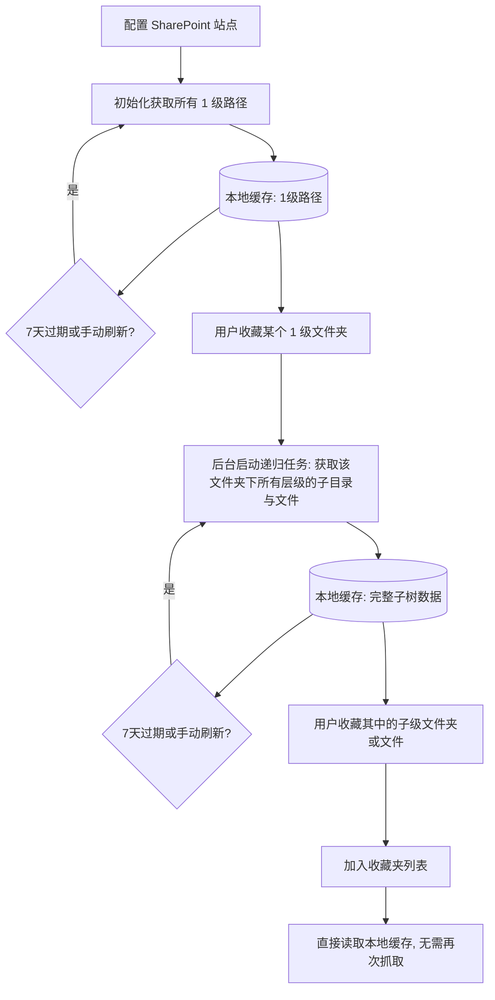

# 产品需求文档 (PRD)：SharePoint 快速访问 Chrome 插件 (SharePoint Quick Access Extension)

## 1. 项目概述

### 1.1 背景与痛点
SharePoint 是企业常用的文档协作平台，但其 Web 端界面加载缓慢，层级导航深，寻找和访问常用文件夹/文件需要多次点击和等待，严重影响日常办公效率。

### 1.2 目标
开发一款 Chrome 浏览器扩展程序，利用用户在浏览器中现有的 SharePoint 登录会话（免登录注册，无缝读取会话 Cookie），通过在本地缓存 SharePoint 目录结构，提供极速的**层级折叠展开浏览**、**全局模糊搜索**、**快速打开网页**和**一键复制链接**功能。配合现代的**液态玻璃（Liquid Glassmorphism）风格**，提供极致的视觉体验和操作流畅度。

---

## 2. 核心功能需求

### 2.1 基础配置与免登录连接
*   **配置页面 (Options Page)**：
    *   用户需输入 SharePoint 站点 URL（例如 `https://company.sharepoint.com/sites/Marketing`）。
    *   用户需输入 Document Library 文档库名称（例如 `Shared Documents` 或 `共享文档`）。
    *   支持动态主机权限申请：当用户输入非默认域名时，前端调用 `chrome.permissions.request` 动态申请对该域名的跨域网络请求权限。
*   **连通性测试**：提供“保存并测试连接”按钮。扩展会利用当前浏览器的 Cookie 发送请求验证连通性。如果用户未登录 SharePoint，将引导其先去网页端完成登录。

### 2.2 目录获取与缓存策略 (核心)

#### 2.2.1 1 级目录缓存
*   **获取范围**：初始化或手动更新时，通过调用 SharePoint REST API (`_api/web/lists/getbytitle(...)`) 获取指定文档库下的**所有 1 级目录及文件**。
*   **本地缓存**：使用 `chrome.storage.local` 存储这些数据（包括名称、类型、服务器相对路径、Web 网页 URL 等）。
*   **自动更新**：后台 Service Worker 每 7 天自动发起一次全量同步更新。
*   **手动更新**：Popup 提供“手动刷新”按钮，点击可立即触发 1 级目录的更新。
*   **收藏功能**：用户可将 1 级目录添加至收藏夹。

#### 2.2.2 1 级收藏子树全量递归缓存
*   **触发条件**：当用户在列表中**收藏**了一个 1 级文件夹时。
*   **获取范围**：Popup 触发后台 Service Worker，启动**递归遍历任务**，自动获取该 1 级文件夹下**所有的子文件夹和文件（不限深度，全量拉取）**。
*   **本地缓存**：将该文件夹下的完整子树扁平化或嵌套缓存至本地。
*   **2 级及以下收藏**：用户在展开浏览子目录时，也可以将其单独加入收藏夹。但由于其父级（1 级目录）已经被收藏且子树已被全量缓存，因此**不触发任何额外的网络抓取任务**。
*   **更新机制**：每 7 天自动在后台更新 1 级目录以及已被收藏的 1 级目录所对应的整棵子树。

#### 2.2.3 数据同步流程图

### 2.3 路径交互与操作 (Popup 界面)
*   **树状层级浏览**：
    *   目录树支持层层折叠和展开，伴随平滑过渡动画。
    *   只有已收藏 1 级目录的子文件夹可以秒级展开（因为已本地缓存）。对未收藏的 1 级目录，点击展开时会显示“提示：请收藏该 1 级目录以加载子目录”。
*   **路径操作按钮**：
    *   悬浮于条目上时，右侧划出操作按钮：
        1.  **打开 (Open)**：在新标签页中直接打开对应的 SharePoint 网页。
        2.  **复制 (Copy)**：一键复制绝对 Web URL，并弹出微秒级 Toast 提示。

### 2.4 全局模糊搜索
*   **检索范围**：在 Popup 顶部放置搜索框。输入时实时检索**本地已缓存**的所有文件夹和文件的名称及路径。
*   **结果展现**：
    *   列表展示匹配项，以浅色字体标出其父路径。
    *   每个搜索结果卡片右侧同样配备 **“打开”** 和 **“复制”** 按钮。

---

## 3. UI/UX 视觉设计规范 (液态玻璃风格)

### 3.1 视觉要素定义
*   **背景 (Background)**：
    *   深邃暗色底色（如 `#0a0b10` 到 `#12131a` 的对角渐变）。
    *   包含 2-3 个由 CSS 关键帧动画控制漂移、缩放、并带有大高斯模糊的**彩色流光圆 (Fluid Blobs)**。
*   **毛玻璃容器 (Glass Panels)**：
    *   `background: rgba(255, 255, 255, 0.03)`
    *   `backdrop-filter: blur(20px) saturate(160%)`
    *   `border: 1px solid rgba(255, 255, 255, 0.08)`
*   **动效 (Micro-animations)**：
    *   **划过与折叠**：列表悬浮微微提亮并伴随微距缩放；折叠展开动画平滑不突兀。
    *   **复制反馈**：图标变为打勾并伴随水滴回弹动画，展示极致细节。

---

## 4. 技术方案与架构

*   **运行环境**：Chrome Extension Manifest V3。
*   **UI 框架**：Vanilla HTML / CSS / JS，保持插件毫秒级冷启动。
*   **数据访问**：利用 `fetch` 发起网络请求，配置 `credentials: 'include'`，通过现有网页登录态直接访问 SharePoint REST API。
*   **存储引擎**：`chrome.storage.local` 用于存储配置、收藏项与本地缓存树。

---

## 5. 验证与测试用例

1.  **动态主机权限测试**：测试非 `.sharepoint.com` 域名，在保存时是否能触发 Chrome 原生权限申请弹窗。
2.  **免密拉取测试**：登录网页端后，验证插件能否正常拉取文档库 1 级目录。
3.  **全量递归抓取测试**：收藏 1 级文件夹后，验证后台 Service Worker 能否通过 `GetFolderByServerRelativeUrl` API 将所有嵌套层级的子孙文件全量抓取并成功缓存。
4.  **全局搜索与复制**：测试在搜索栏输入字符，能否即时过滤深层文件，且复制按钮是否好用。
